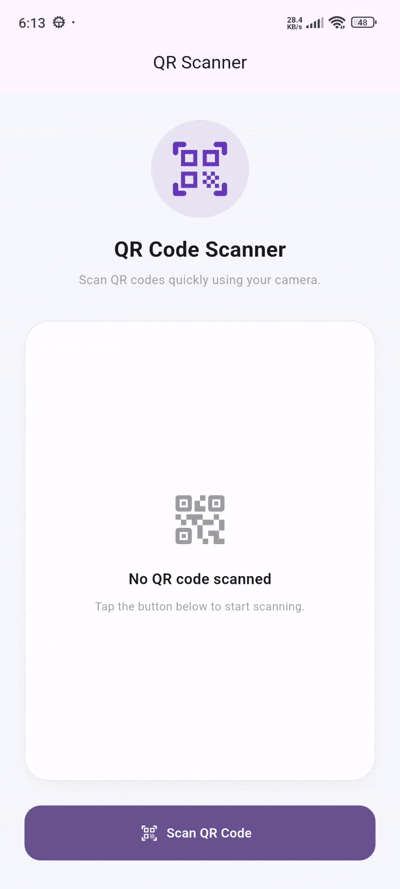

# flutter_qr_scanner

[](https://flutter.dev)
[](https://opensource.org/licenses/MIT)
[](#)

**flutter_qr_scanner** is a premium, highly customizable, and easy-to-use real-time QR code & barcode scanner library for Flutter. It features camera switching, flash/torch toggles, custom overlay indicators with rounded cutouts, full camera controller access, single-scan & continuous scan modes, and seamless screen or inline widget integration.

---

## 📷 Preview

<p align="center">
  
</p>

*A premium interactive QR scanner featuring real-time camera preview, custom overlay indicators, torch toggles, front/back camera switching, and effortless integration.*

---

## ✨ Features

- **📷 Real-Time Camera Preview & Scanning**
  - Powered by high-performance camera streaming to quickly detect QR codes and various barcode formats.
- **⚡ Camera Controls**
  - Built-in floating controls for toggling flash/torch and switching between front and rear cameras seamlessly.
- **🖼️ Customizable Scanning Overlay**
  - Custom cutout overlay with configurable border width, corner radius, corner lengths, and background mask color.
- **⚙️ Configurable Scanning Modes**
  - Toggle between single-scan mode (`scanOnce: true`) and continuous scanning mode effortlessly using `QRScannerConfig`.
- **🚀 Ready-to-Use Screen & Inline Widget Modes**
  - Use `QRScannerScreen` for a plug-and-play full-screen scanner page or embed `QRScannerWidget` directly inside your custom layout.
- **🔒 Programmatic Controller Control**
  - Full control over camera start, stop, pause, resume, torch, and camera facing options via `QRScannerController`.

---

## 📦 Installation

To use this library in your Flutter project, add it to your `pubspec.yaml` dependencies:

```yaml
dependencies:
  flutter:
    sdk: flutter
  # From pub.dev
  flutter_qr_scanner: ^0.0.1
```

Or reference it directly from a Git repository:

```yaml
dependencies:
  flutter_qr_scanner:
    git:
      url: https://github.com/your_username/flutter_qr_scanner.git
      ref: main
```

---

## 🚀 Usage

Import the package in your Dart code:

```dart
import 'package:flutter_qr_scanner/flutter_qr_scanner.dart';
```

### 1. Simple Full-Screen Scanner (`QRScannerScreen`)
Launch a full-screen scanner using standard Flutter navigation and handle the result on scan.

```dart
final QRScanResult? result = await Navigator.push<QRScanResult>(
  context,
  MaterialPageRoute(
    builder: (context) => QRScannerScreen(
      onScan: (result) {
        Navigator.pop(context, result);
      },
    ),
  ),
);

if (result != null) {
  print('Scanned Value: ${result.value}');
}
```

### 2. Standalone Inline Scanner Widget (`QRScannerWidget`)
Embed the scanner widget directly into your custom page layout.

```dart
QRScannerWidget(
  config: const QRScannerConfig(
    scanOnce: true,
    showOverlay: true,
    overlaySize: 260.0,
    overlayColor: Colors.deepPurple,
  ),
  onScan: (QRScanResult result) {
    print('Scanned code: ${result.value}');
  },
  onError: (error) {
    print('Scanner error: $error');
  },
)
```

### 3. Custom Scanner Configuration (`QRScannerConfig`)
Set specific visual and behavioral options for the scanner overlay and controls.

```dart
const config = QRScannerConfig(
  scanOnce: true,
  showOverlay: true,
  showFlashButton: true,
  showCameraSwitchButton: true,
  overlaySize: 280.0,
  overlayColor: Colors.greenAccent,
  overlayBorderWidth: 4.0,
  overlayBorderRadius: 24.0,
  controlsAlignment: Alignment.bottomCenter,
);
```

### 4. Programmatic Camera Control (`QRScannerController`)
Pass your own `QRScannerController` to pause/resume detection, toggle torch, or switch cameras programmatically.

```dart
final controller = QRScannerController();

// Toggle camera torch/flash
await controller.toggleFlash();

// Switch between front and rear cameras
await controller.switchCamera();

// Pause or resume scanning
await controller.pause();
await controller.resume();

// Always dispose when finished
controller.dispose();
```

---

## 🛠️ API Reference

### `QRScannerScreen` Properties

| Property | Type | Default | Description |
| :--- | :--- | :--- | :--- |
| `onScan` | `ValueChanged<QRScanResult>` | Required | Callback triggered when a QR code is successfully scanned. |
| `config` | `QRScannerConfig` | `const QRScannerConfig()` | Configuration for scanning rules and UI elements. |
| `controller` | `QRScannerController?` | `null` | Optional external controller for camera state management. |
| `onError` | `ValueChanged<Object>?` | `null` | Callback triggered when a scanner error occurs. |
| `title` | `String` | `'Scan QR Code'` | Title text displayed on the AppBar. |
| `showAppBar` | `bool` | `true` | Whether to display the standard top AppBar. |

### `QRScannerWidget` Properties

| Property | Type | Default | Description |
| :--- | :--- | :--- | :--- |
| `onScan` | `ValueChanged<QRScanResult>` | Required | Callback triggered when a QR code is successfully scanned. |
| `config` | `QRScannerConfig` | `const QRScannerConfig()` | Configuration for scanning rules and UI elements. |
| `controller` | `QRScannerController?` | `null` | Optional external controller for camera state management. |
| `onError` | `ValueChanged<Object>?` | `null` | Callback triggered when a scanner error occurs. |

### `QRScannerConfig` Properties

| Property | Type | Default | Description |
| :--- | :--- | :--- | :--- |
| `scanOnce` | `bool` | `true` | Whether to stop capturing after the first valid scan. |
| `showOverlay` | `bool` | `true` | Whether to display the target cutout scanning overlay. |
| `showFlashButton` | `bool` | `true` | Whether to show the flash/torch toggle action button. |
| `showCameraSwitchButton` | `bool` | `true` | Whether to show the front/rear camera switch button. |
| `overlaySize` | `double` | `260.0` | Width and height of the square scanning area frame. |
| `overlayColor` | `Color` | `Colors.white` | Border color of the target scanning frame. |
| `overlayBorderWidth` | `double` | `3.0` | Line width of the scanning frame border. |
| `overlayBorderRadius` | `double` | `20.0` | Corner radius of the scanning cutout window. |
| `controlsAlignment` | `Alignment` | `Alignment.bottomCenter` | Alignment layout of the scanner action control buttons. |

### `QRScanResult` Properties

| Property | Type | Description |
| :--- | :--- | :--- |
| `value` | `String` | Decoded string payload extracted from the scanned barcode/QR code. |
| `format` | `BarcodeFormat` | Format of the scanned code (e.g., `qrCode`, `code128`). |
| `rawBytes` | `List<int>?` | Raw decoded bytes returned by the scanner, if available. |

### `QRScannerController` Methods & Properties

| Method / Property | Return Type | Description |
| :--- | :--- | :--- |
| `start()` | `Future<void>` | Starts the camera feed and scanner detection loop. |
| `stop()` | `Future<void>` | Stops the camera feed and releases hardware focus. |
| `pause()` | `Future<void>` | Pauses barcode detection without stopping camera stream. |
| `resume()` | `Future<void>` | Resumes active barcode detection loop. |
| `switchCamera()` | `Future<void>` | Toggles between front-facing and rear cameras. |
| `toggleFlash()` | `Future<void>` | Toggles the hardware flash/torch state. |
| `isFlashOn` | `bool` | Returns `true` if torch is currently enabled. |
| `dispose()` | `void` | Releases camera and controller resources safely. |

---

## 📄 License

```lic
MIT License

Copyright (c) 2026 Excelsior Technologies

Permission is hereby granted, free of charge, to any person obtaining a copy
of this software and associated documentation files (the "Software"), to deal
in the Software without restriction, including without limitation the rights
to use, copy, modify, merge, publish, distribute, sublicense, and/or sell
copies of the Software, and to permit persons to whom the Software is
furnished to do so, subject to the following conditions:

The above copyright notice and this permission notice shall be included in all
copies or substantial portions of the Software.

THE SOFTWARE IS PROVIDED "AS IS", WITHOUT WARRANTY OF ANY KIND, EXPRESS OR
IMPLIED, INCLUDING BUT NOT LIMITED TO THE WARRANTIES OF MERCHANTABILITY,
FITNESS FOR A PARTICULAR PURPOSE AND NONINFRINGEMENT. IN NO EVENT SHALL THE
AUTHORS OR COPYRIGHT HOLDERS BE LIABLE FOR ANY CLAIM, DAMAGES OR OTHER
LIABILITY, WHETHER IN AN ACTION OF CONTRACT, TORT OR OTHERWISE, ARISING FROM,
OUT OF OR IN CONNECTION WITH THE SOFTWARE OR THE USE OR OTHER DEALINGS IN THE
SOFTWARE.
```
